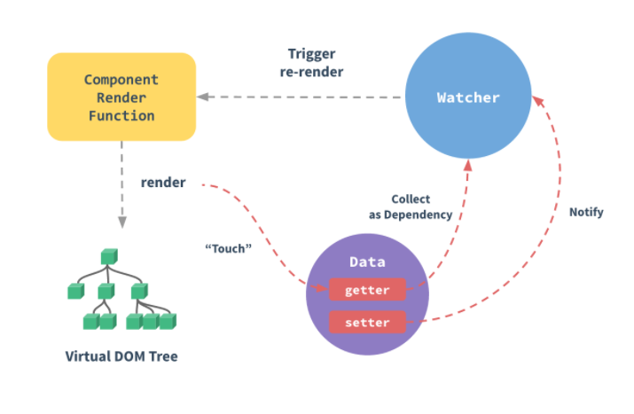

It is not exaggerated to say the *Reactivity System* is most amazing part of the Vue. It helps developer to focus on the states instead of how to render the view. The state management has never been easy like this.  
  
As Vue doc describes:
> The unobtrusive reactivity system makes state management simple and intuitive.

Therefore, for every Vue developer, it is crucial to understand how the *Reactivity System* works. In this chapter, we are going to focus on explaining how the *Reactivity System* works internally.

This is the image used by Vue doc to describe how reactivity works. You can ignore the `Component Render Function` and `Virtual Dom Tree` in this charpter. Both will be explained in the next chapter.
According to the image of the "Reactivity in Depth" to introduce each part.

The Vue document talks about the basic idea how the whole system works, but leaves a lot of details in blank. To understand these details might help you answer a lot of questions and issues encountered in your daily work.   

In this charpter, we will answer:

1. What are the essential parts of the *Reactivity System*?
2. How the Vue turn the `options.data` into reactive data?
3. What is the watcher?
4. How does the watcher respond to the change?