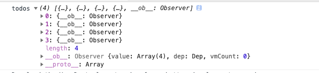
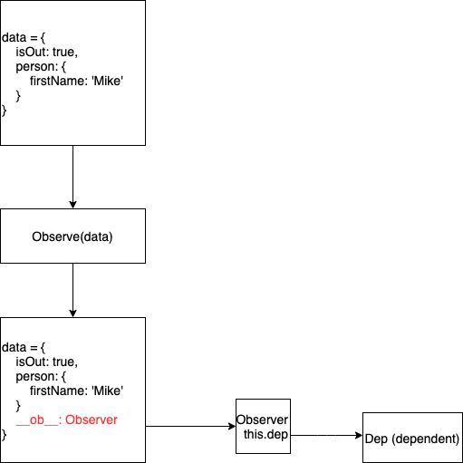
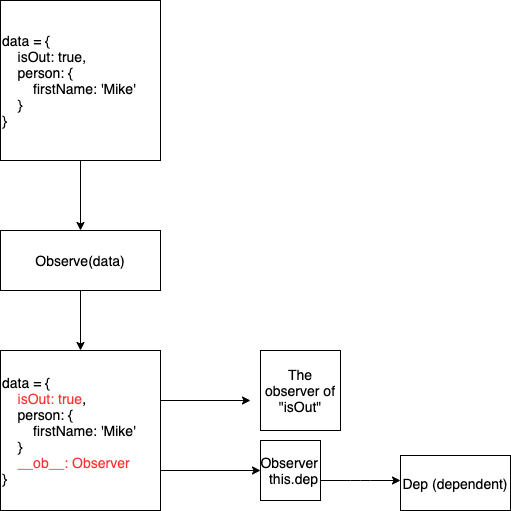

## The "observe" method
The method `observe` is defined in `core/observer/index`. Its job is creating an `Observer` on the `value`.
```js
/**
 * Attempt to create an observer instance for a value,
 * returns the new observer if successfully observed,
 * or the existing observer if the value already has one.
 */
export function observe (value: any, asRootData: ?boolean): Observer | void {
  if (!isObject(value) || value instanceof VNode) {
    return
  }
  let ob: Observer | void
  if (hasOwn(value, '__ob__') && value.__ob__ instanceof Observer) {
    ob = value.__ob__
  } else if (
    shouldObserve &&
    !isServerRendering() &&
    (Array.isArray(value) || isPlainObject(value)) &&
    Object.isExtensible(value) &&
    !value._isVue
  ) {
    ob = new Observer(value)
  }
  if (asRootData && ob) {
    ob.vmCount++
  }
  return ob
}
```
The `observe` receives two parameters `value` and `asRootData`. 
As we explained in last chapter, in the `initData`: 
1. The `value` is the returned value of `vm.$options.data` function.
2. The `asRootData` is `true`.

There are a number of things that are not able to be turned into a reactive data:
1. [Native data types](https://developer.mozilla.org/en-US/docs/Web/JavaScript/Data_structures)
2. The virtual DOM node.

Therefore, it checks if the `value` is an object. **It uses `isObject`, not `isPlainObject` which means `Array` is valid as well**.
If `value` is not an object or an instance of `VNode`, then it can't be turn to reactive, so it directly returns.  

If none of above conditions are met, then it defines a variable `ob`.
From the flow defintion, we know the `ob` should point to an instance of `Observer` class.  
```js
let ob: Observer | void
```
Next, it comes to a `if...else if` block.
```js
if (hasOwn(value, '__ob__') && value.__ob__ instanceof Observer) {
  ob = value.__ob__
} else if (
  shouldObserve &&
  !isServerRendering() &&
  (Array.isArray(value) || isPlainObject(value)) &&
  Object.isExtensible(value) &&
  !value._isVue
) {
  ob = new Observer(value)
}
```
Let's check the `if` condition first.
```js
if (hasOwn(value, '__ob__') && value.__ob__ instanceof Observer) {
  ob = value.__ob__
}
```
I bet you must be familar with `__ob__` since it always shows up when you `console.log` any reactive data.  

  

For many beginners, they might have this question:  **Why is it needed?**

We will take this question through the next few chapters. When you fully understand the reactity system, this question will be answered.  

The condition checks if the `value` has `__ob__` and the `__ob__` is an instance of `Observer`. If yes, it assigns the `value.__ob__`
to variable `ob`.  As we said before, the variable `ob` should point to `Observer`. Therefore, the `__ob__` points to an `Observer` as well.
This avoids creating `Observer` again.  

If the `value` doesn't have the `__ob__`, it goes to `else if`.
```js
  } else if (
    shouldObserve &&
    !isServerRendering() &&
    (Array.isArray(value) || isPlainObject(value)) &&
    Object.isExtensible(value) &&
    !value._isVue
  ) {
  ob = new Observer(value)
}
```
In `else if`, it only has one line of code to execute which create a new instance of `Observer` class and assign it to `ob`.  

Instead, the conditions are more important.
1. `shouldObserve`. This is a global variable which is created for turning on/off the reactivity system.
If `shouldObserve` is `false`, a new `Observer` won't be attached to a new data.
2. It is not rendered on the server which means reactivity system is only activated on Web.
3. `value` is either an array or a plain object. Remember, at the beginning of `observe`, it checks if `value` is an object.
4. `value` is [extensible](https://developer.mozilla.org/en-US/docs/Web/JavaScript/Reference/Global_Objects/Object/isExtensible).
This is why using `Object.freeze` can prevent an object from being reactive.
5. `value` is not Vue instance.

The last part of `observe` is
```js
  if (asRootData && ob) {
    ob.vmCount++
  }
```
In `initData`, `asRootData` is passed and its value is `true`. If `ob` has value as well, then `ob.vmCount` plus one.  

At last, the `ob` is returned.

## Observer Class
If all the conditions of `else if` are met, then it creates an instance of `Observer` class by passing the `value`.
```js
ob = new Observer(value)
```
The `Observer` class is defined in `core/observer/index`.
```js
/**
 * Observer class that is attached to each observed
 * object. Once attached, the observer converts the target
 * object's property keys into getter/setters that
 * collect dependencies and dispatch updates.
 */
export class Observer {
  value: any;
  dep: Dep;
  vmCount: number; // number of vms that have this object as root $data

  constructor (value: any) {
    this.value = value
    this.dep = new Dep()
    this.vmCount = 0
    def(value, '__ob__', this)
    if (Array.isArray(value)) {
      if (hasProto) {
        protoAugment(value, arrayMethods)
      } else {
        copyAugment(value, arrayMethods, arrayKeys)
      }
      this.observeArray(value)
    } else {
      this.walk(value)
    }
  }

  /**
   * Walk through all properties and convert them into
   * getter/setters. This method should only be called when
   * value type is Object.
   */
  walk (obj: Object) {
    const keys = Object.keys(obj)
    for (let i = 0; i < keys.length; i++) {
      defineReactive(obj, keys[i])
    }
  }

  /**
   * Observe a list of Array items.
   */
  observeArray (items: Array<any>) {
    for (let i = 0, l = items.length; i < l; i++) {
      observe(items[i])
    }
  }
}
```
The implementation of `Observer` class is not complex. Except the `constructor`, it only has two methods `walk` and `observeArray`.
Let's look at the `constructor` first.
```js
export class Observer {
  ...
  constructor (value: any) {
    this.value = value
    this.dep = new Dep()
    this.vmCount = 0
    def(value, '__ob__', this)
    if (Array.isArray(value)) {
      if (hasProto) {
        protoAugment(value, arrayMethods)
      } else {
        copyAugment(value, arrayMethods, arrayKeys)
      }
      this.observeArray(value)
    } else {
      this.walk(value)
    }
  }
  ...
}
```
The `constructor` only receive one parameter - `value`.  
At the beginning, it sets three instance varaibles.  
1. `this.value`: Keep the reference to the `value`
2. `this.dep`: Point to an instance of `Dep` class. We will explain the `Dep` class in detail in the later chapter.
3. `this.vmCount`: The number of components who are using this observer.

Next statement is:
```js
def(value, '__ob__', this)
```
The explanation of `def` is [here](http://localhost:8080/vue/shared-utils/#def).  

The `__ob__` is defined on `value` and its value is the current instance of the `Observer` class.  

Since the third parameter - `enumerable` is not passed, the `__ob__` isn't enumerable.
Therefore, it is safe to use `Object.keys` or `for...in` to iterate the reactive data.  

After defining the `__ob__`, our diagram would be:


Next, Vue has to perform differently based on whether the `value` is an `Object` or `Array`.
```js
if (Array.isArray(value)) {...} else {...}
```
In the method `observe`, one of the five conditions is `value` must be either an `Array` or an `Object`. So, in `if` block,
it deals with the `Array` situation, and in `else` block, it deals with `Object` situation.  

### Turn Array to be reactive
For `Object`, as we know, it uses `getter/setter` to interfere any read/update operation.  

For `Array`, it uses the same thinking except 
`Array` has a number of methods which could change the value of `Array`. Therefore, what `Array` needs to do is wrapping these methods.
Let's take a look at the code.  

```js
if (Array.isArray(value)) {
  if (hasProto) {
    protoAugment(value, arrayMethods)
  } else {
    copyAugment(value, arrayMethods, arrayKeys)
  }
  this.observeArray(value)
} else {
```
The `hasProto` checks if the environment can use [__proto__](https://developer.mozilla.org/en-US/docs/Web/JavaScript/Reference/Global_Objects/Object/proto)
```js
// can we use __proto__?
export const hasProto = '__proto__' in {}
```
If yes, it calls `protoAugment`:
```js
/**
 * Augment a target Object or Array by intercepting
 * the prototype chain using __proto__
 */
function protoAugment (target, src: Object) {
  /* eslint-disable no-proto */
  target.__proto__ = src
  /* eslint-enable no-proto */
}
```
Simple. It sets the prototype of `target` to `src`.  
If the environment can use `__proto__`, it directly sets the prototype of `target` to `arrayMethods`.
Otherwise, it calls `copyAugment`
```js
/**
 * Augment a target Object or Array by defining
 * hidden properties.
 */
/* istanbul ignore next */
function copyAugment (target: Object, src: Object, keys: Array<string>) {
  for (let i = 0, l = keys.length; i < l; i++) {
    const key = keys[i]
    def(target, key, src[key])
  }
}
```
The `copyAugment` copies the `keys` to the `target` and the value is from `src`. So, it gets the keys from `arrayKeys` to `value`
and the value of the `key` comes from the `arrayMethods`.  

Both `copyAugment` and `protoAugment` set the `value` to use the `arrayMethods`. When the environment doesn't allow the
`__proto__`, it directly copies those methods.  

The `arrayKeys` are defined at the beginning of `core/observer/index`.
```js
const arrayKeys = Object.getOwnPropertyNames(arrayMethods)
```
We can see it is from the `arrayMethods` as well.  

The `arrayMethods` is defined in `core/observer/array`.
```js
const arrayProto = Array.prototype
export const arrayMethods = Object.create(arrayProto)
```
It is created from the prototype of `Array` - `Array.prototype`.  

Next, in `core/observer/array`, it defines all the methods needs to be patched.
```js
const methodsToPatch = [
  'push',
  'pop',
  'shift',
  'unshift',
  'splice',
  'sort',
  'reverse'
]
```
**Why are these methods?**   

Because these methods modify the `Array` in place.  

Next, these methods are patched and `arrayMethods` are re-defined by patched methods.
```js
/**
 * Intercept mutating methods and emit events
 */
methodsToPatch.forEach(function (method) {
  // cache original method
  const original = arrayProto[method]
  def(arrayMethods, method, function mutator (...args) {
    const result = original.apply(this, args)
    const ob = this.__ob__
    let inserted
    switch (method) {
      case 'push':
      case 'unshift':
        inserted = args
        break
      case 'splice':
        inserted = args.slice(2)
        break
    }
    if (inserted) ob.observeArray(inserted)
    // notify change
    ob.dep.notify()
    return result
  })
})
```
It loops through each method defined in the `methodsToPatch`. 

Firstly, it gets the original method from the `Array.prototype` and saves it to `result`.
```js
const ob = this.__ob__
```
`this.__ob__` might not be easy to understand. Let's use an example to explain.
```js
const foo = ['foo1'];
observe(foo);
foo.push('test');
```
After `observe(foo)`, `foo.__ob__` is created and points to an observer. We have explained this.  
When `push` is called, `this` is `foo`. Therefore, `ob` is the observer of the `foo`.  

Then, it comes to a `switch` statement.
```js
let inserted
switch (method) {
  case 'push':
  case 'unshift':
    inserted = args
    break
  case 'splice':
    inserted = args.slice(2)
    break
}
```
If there is new data added to the `Array`, this new data needs to be observed as well. Among
`methodsToPatch`, only `push`, `unshift` and `splice` could add new data. Therefore, `switch` statement is used to get the new data from the parameter.  

`push` and `unshift` only receive one parameter. In case of `splice`, from the third parameter, it is the new data - `args.slice(2)`.

```js
if (inserted) ob.observeArray(inserted)
// notify change
ob.dep.notify()
return result
```
If the `inserted` is existed, then it calls `observeArray` on the observer. Then, the `dep` of observer is notified. This will be explained in detail later.

Now, we know `arrayMethods` has a bunch of patched methods which could notify the dependent when the value of array is changed.  
However, if we just change the value through the index of `array`, how does Vue reactivity system detects the change?  
The answer is Vue can't. That is why Vue ask to use `Vue.set` in this case.  

Now, Let's get back to the constructor of `Observer` class, after `if (hasProto) else ...`, it comes to
```js
this.observeArray(value)
```
Finally, it calls `observeArray` to start observing the `Array`.
It is defined on the `Observer` class:
```js
/**
 * Observe a list of Array items.
 */
observeArray (items: Array<any>) {
  for (let i = 0, l = items.length; i < l; i++) {
    observe(items[i])
  }
}
```
Pretty simple. It iterates the `value` and calls `observe` on each item.

### Turn Object to be reactive
If the `value` is an object, in `else` block, it walks the `value`.
```js
  this.walk(value)
```
`walk` is one of the two methods of `Observer` class.
```js
/**
 * Walk through all properties and convert them into
 * getter/setters. This method should only be called when
 * value type is Object.
 */
walk (obj: Object) {
  const keys = Object.keys(obj)
  for (let i = 0; i < keys.length; i++) {
    defineReactive(obj, keys[i])
  }
}
```
The comment describes what `walk` does. The implementation is fairly easy.
It gets all enumerable properties on `obj` and iterates the `keys` to `defineReactive` on each one of them.  

In the section ["Reactivity in Depth"](https://vuejs.org/v2/guide/reactivity.html) of the official doc:
> When you pass a plain JavaScript object to a Vue instance as its data option, Vue will walk through all of its properties and convert them to getter/setters using Object.defineProperty.  

This is what `defineReactive` does, let's see how it is implemented.  

The `defineReactive` is defined right below the method `observe`.
For the simplicity, I removed some code.
```js
/**
 * Define a reactive property on an Object.
 */
export function defineReactive (
  obj: Object,
  key: string,
  val: any,
  customSetter?: ?Function,
  shallow?: boolean
) {
  const dep = new Dep()

  const property = Object.getOwnPropertyDescriptor(obj, key)
  if (property && property.configurable === false) {
    return
  }

  // cater for pre-defined getter/setters
  const getter = property && property.get
  const setter = property && property.set
  if ((!getter || setter) && arguments.length === 2) {
    val = obj[key]
  }

  let childOb = !shallow && observe(val)
  Object.defineProperty(obj, key, {
    enumerable: true,
    configurable: true,
    get: function reactiveGetter () { ... },
    set: function reactiveSetter (newVal) { ... }
  })
}
```
`defineReactive` receives five parameters. In `walk`, it only uses the first two parameters though - `obj` and `key`.
```js
const dep = new Dep();
```
Last time we see `new Dep()` is in the constructor of `Observer` class. It is the observer of the `Object` or `Array`.
Now, the `dep` is declared in the scope of the `defineReactive` and `defineReactive` is used for defining each property on the `obj`.
Therefore, this `dep` is the observer of each property on the `Object`.  

  

**Differences**:  
On `Object` itself, `__ob__` points to the observer.  
On the property of `Object`, the observer is wrapped in the scope of `defineReactive`. Each property has its own `dep`.  

Let's take a closer look on what is the `Dep`.  

The `Dep` class is defined in `core/observer/dep`.  
`pushTarget` and `popTarget` have already explained [here](http://localhost:8080/vue/reactivity/data.html#get-the-data-of-vm-options-data).  
The definition of `Dep` class is pretty much the rest of this file.
```js
/**
 * A dep is an observable that can have multiple
 * directives subscribing to it.
 */
export default class Dep {
  static target: ?Watcher;
  id: number;
  subs: Array<Watcher>;

  constructor () {
    this.id = uid++
    this.subs = []
  }

  addSub (sub: Watcher) {
    this.subs.push(sub)
  }

  removeSub (sub: Watcher) {
    remove(this.subs, sub)
  }

  depend () {
    if (Dep.target) {
      Dep.target.addDep(this)
    }
  }

  notify () {
    // stabilize the subscriber list first
    const subs = this.subs.slice()
    if (process.env.NODE_ENV !== 'production' && !config.async) {
      // subs aren't sorted in scheduler if not running async
      // we need to sort them now to make sure they fire in correct
      // order
      subs.sort((a, b) => a.id - b.id)
    }
    for (let i = 0, l = subs.length; i < l; i++) {
      subs[i].update()
    }
  }
}
```
Let's ignore the four methods now. They will be explained when we explain the `getter/setter`.  

`id` is a number. In the `constructor`, the `id` will be initialized as a unique number.  
`sub` is an array of `Wachter`. In the `constrcutor`, it is initialized as an empty array.    

The `new Dep()` is done, let's get back to `defineReactive`.
```js
export function defineReactive (
  obj: Object,
  key: string,
  val: any,
  customSetter?: ?Function,
  shallow?: boolean
) {
  ...
  const property = Object.getOwnPropertyDescriptor(obj, key)
  if (property && property.configurable === false) {
    return
  }

  // cater for pre-defined getter/setters
  const getter = property && property.get
  const setter = property && property.set
  ...
}
```
Firstly, it gets the descriptor of the `obj[key]`.  
If `obj[key]` has the descriptor and `configurable` is false, then it directly returns.
Because, if the descriptor is not configurable, then `getter/setter` can not be rewritten.  

It is very possible that developer already defines its own `getter/setter` on `obj[key]`.
For this reason, it needs to save reference to possible pre-defined `setter/getter`.  

The next part would be a little confusing.
```js
if ((!getter || setter) && arguments.length === 2) {
  val = obj[key]
}
let childOb = !shallow && observe(val)
```
To understand this `if` condition, we need to trace back some history.  

It was originally added to solve issue [#7280](https://github.com/vuejs/vue/issues/7280).
Before the fix of this issue, the `definedReactive` is called with third parameter in the `walk`.
```js
walk (obj: Object) {
  const keys = Object.keys(obj)
  for (let i = 0; i < keys.length; i++) {
    defineReactive(obj, keys[i], obj[keys[i]]) // <== Here, the third parameter is the val.
  }
}
```
Therefore, if the property has a pre-defiend `getter`, the `getter` will be called when that property is defined as reactive.
Since, the definition of the `getter` is unpredicatable, it could be a very time consuming operation. Developer
may want to call the `getter` explictly. This is what issue #7280 argues.  

The solution is getting the value of `obj.key` inside of `defineReactive` when `obj.key` doesn't have the `getter`
and the `arguments` of `defineReactive` only has two parameters since the third is `val`.
```js
if (!getter && arguments.length === 2) {
  val = obj[key]
}
let childOb = !shallow && observe(val)
```
With this implementation, as long as the property has `getter`, the `val` won't be turned into reactive since the `observe` is no-op.
However, if a property with both `getter/setter` defined, it becomes asymmetry.  

When the reactivity is initialized, since the `getter` is not called, its value won't be reactive. As a result, whenever the property
is set to a new value, the new value is observed inside of `settter` and turned to reactive. This is the issue [#7828](https://github.com/vuejs/vue/pull/7828).  

To solve this inconsistent behavior, the reporter argues that when both `getter/setter` are defined, it should get the value just like before #7280. This is why the condition becomes `(!getter || setter)`.
```js
let childOb = !shallow && observe(val)
```
`shallow` is the last parameter of the `defineReactive`. In `walk`, its value is `undefined`. Therefore, `observe(val)` is called and `val`
is turned to reactive recursively. The result is assigned to `childOb`.
```js
export function defineReactive (
  obj: Object,
  key: string,
  val: any,
  customSetter?: ?Function,
  shallow?: boolean
) {
  ...
  Object.defineProperty(obj, key, {
    enumerable: true,
    configurable: true,
    get: function reactiveGetter () {
      ...
    },
    set: function reactiveSetter (newVal) {
      ...
    }
  })
  ...
}
```
All the properties are defined as enumerable and configurable. This is safe because:
1. In `walk`, it only iterates the enumerable properties.
2. If the property isn't configurable, the `defineReactive` returns at beginning.  

The `getter/setter` are defined as `reactiveGetter` and `reactiveSetter`.  

The `defineReactive` is done and the whole `observe` is finsihed as well.
You might be curious why we didn't talk about the actual implementation of `reactiveGetter` and `reactiveSetter`.
Because, without introducing the `watcher`, it would be confusing.  

By far, it only sets up the necessary infrastructure on `data` so that the `watcher` can watch and detect the change.
Without the `Observer` and `dep`, the `watcher` won't work. This could be considered as half work of reactivity.  

In the next chapter, we will introduce the other half of reactivity - `watcher`.