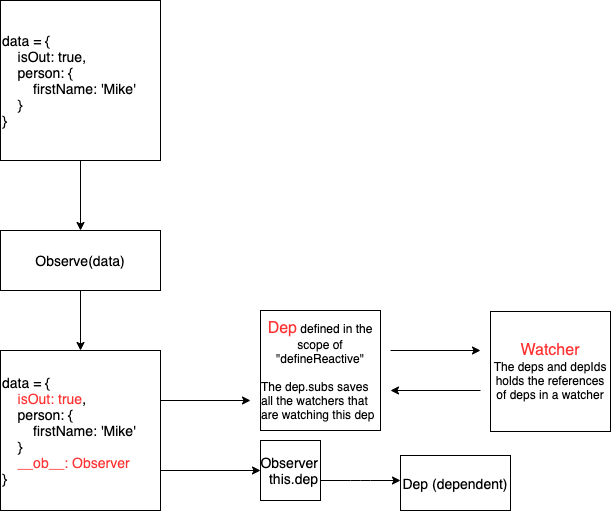

So far, we have talked about what is `dep` and how is it initialized. But, we haven't talked about:  

**Why is `dep` needed?**  

Let's take a look at a simple example.
```vue
<script>
export default {
  name: 'todo',
  data: {
    todo: {
      text: "Finish the design", // <= holds a dep
      done: false // <= holds a dep
    } // <= holds an observer object.
  },
  watch: {
    'todo.done': function todoIsDone() { ... }
  },
  computed: {
    title() {
      return this.todo.text + ` is done: ${this.todo.done}`;
    }
  }
}
</script>
```
The object `todo` is defined in the `data`. There is a `watcher` to watch on `todo.done`.  

After the initialization of computed property `title`, `todo.text` holds a `dep` which is defined by `defineReactive` - closure `dep`. 

In Observer pattern, the `Subject` is used for collecting the dependents and notfiy the dependents whenever there is change on the `Subject`. In Vue reactivity system, the `dep` plays this role.  

For every property of a reactive object, it has a `dep`. Any change on them will notify the depdendents.  

Then, the question is:  

**What is the depedent?**  

To answer this question, we must think what reacts to the change of reactive objects.  
1. Computed Properties
2. Watch 
3. Render function (aka. The \<template\> in the single file component)

We have talked about the computed properties. At the end, the computed property is a `watcher`.
Now, let's take a look at the `watch`. 

## Initialize "watch" option
The `initWatch` is called at the last in `initState`.
```js
export function initState (vm: Component) {
  ...
  if (opts.watch && opts.watch !== nativeWatch) {
    initWatch(vm, opts.watch)
  }
  ...
}
```
It checks whether the `opts.watch` is defined and `opts.watch` is not a `Object.prototype.watch` in [Firefox](https://developer.mozilla.org/en-US/docs/Archive/Web/JavaScript/Object.watch). 
The `nativeWatch` is defined in the `core/util/env`.
```js
// Firefox has a "watch" function on Object.prototype...
export const nativeWatch = ({}).watch
```
If `opts.watch` isn't the Firefox `Object.prototype.watch`, then call `initWatch` with `opts.watch`.
`initWatch` is defined under the `initMethods`.
```js
function initWatch (vm: Component, watch: Object) {
  for (const key in watch) {
    const handler = watch[key]
    if (Array.isArray(handler)) {
      for (let i = 0; i < handler.length; i++) {
        createWatcher(vm, key, handler[i])
      }
    } else {
      createWatcher(vm, key, handler)
    }
  }
}
```
Firstly, it goes through the `opts.watch`. For each `watch` definition, it gets the handler by `watch[key]` and assign to the const `handler`.  

Remember, in case the component has the children components, the `opts.watch` is an array.  

If the `handler` is an array, it goes through each item in the `handler` and call `createWatcher`. Otherwise, it directly calls the `createWatcher`.
```js
createWatcher(vm, key, handler)
```

## Create a watcher
The `createWatcher` is defined right below the `initWatch`.
```js
function createWatcher (
  vm: Component,
  expOrFn: string | Function,
  handler: any,
  options?: Object
) {
  if (isPlainObject(handler)) {
    options = handler
    handler = handler.handler
  }
  if (typeof handler === 'string') {
    handler = vm[handler]
  }
  return vm.$watch(expOrFn, handler, options)
}
```
In `initWatch`, only the first three parameters are used.  

If the `handler` is defined as an object, for example
```vue
export default {
  watch: {
    todo: {
      handler: function() { ... },
      immediate: true,
      deep: true
    }
  }
}
```
Here is the code of dealing with above example:
```js
if (isPlainObject(handler)) {
  options = handler
  handler = handler.handler
}
```
The entire `handler` is treated as `options` and the `handler.handler` is actual handler of `watch`.  

The `handler` could be a string, for example:
```vue
export default {
  watch: {
    todo: 'doSomething'
  },
  methods: {
    doSomething: function() { ... }
  }
}
```
Here is the code of dealing with above code:
```js
if (typeof handler === 'string') {
  handler = vm[handler]
}
```
In this case, it find the actual handler from the `vm` instance. After formailizing the data, it eventually calls:
```js
return vm.$watch(expOrFn, handler, options)
```
So, every watched property is created by [`vm.$watch`](https://vuejs.org/v2/api/#vm-watch).

## Vue.$watch
`vm.$watch` is defined at the end of `core/instance/state`.
```js
Vue.prototype.$watch = function (
  expOrFn: string | Function,
  cb: any,
  options?: Object
): Function {
  const vm: Component = this
  if (isPlainObject(cb)) {
    return createWatcher(vm, expOrFn, cb, options)
  }
  options = options || {}
  options.user = true
  const watcher = new Watcher(vm, expOrFn, cb, options)
  if (options.immediate) {
    try {
      cb.call(vm, watcher.value)
    } catch (error) {
      handleError(error, vm, `callback for immediate watcher "${watcher.expression}"`)
    }
  }
  return function unwatchFn () {
    watcher.teardown()
  }
}
```
Assign `this` to local variable `vm`.  

The `cb` is the second parameter of the `$watch` which is the callback of `watcher`. 
If the `cb` is a plain object, then it calls `createWatcher` and return. The `createWatcher` eventually calls the `vm.$watch` as well except the `cb` is a function.
```js
options = options || {}
options.user = true
const watcher = new Watcher(vm, expOrFn, cb, options)
```
Assign an empty object to `options` in case `options` is falsy.  

Set the `user` to true. We will talk about what this `user` does.  

Then, it creates a `watcher` instance. As we explained before, the `computed` property eventually creates a `watcher` as well.
So, essentially, the `watch` and `computed` are the same. They are all watchers.  But, there is
slight difference between them. You will understand this difference when we talk about how is `watcher` updated.

```js
if (options.immediate) {
  try {
    cb.call(vm, watcher.value)
  } catch (error) {
    handleError(error, vm, `callback for immediate watcher "${watcher.expression}"`)
  }
}
```
This `if` block handles the [`immediate` option](https://vuejs.org/v2/api/#vm-watch);
If the `immediate` is `ture`, `cb` is instantly called.  

Since `cb` is defined by the developer, it is wrapped inside of `try...catch`.  

Finally, it returns a function `unwatchFn`.
```js
return function unwatchFn () {
  watcher.teardown()
}
```
The `unwatchFn` calls the `teardown` method of `watcher`.  

The `Vue.$watch` is finished. Its core functionality is creating a new instance of `Watcher` class.
Now, Let's take a look at the `Watcher` class.

## The Watcher Class
Before we step into `Watcher` class, Let's revist how is a `watcher` created.
```js
const watcher = new Watcher(vm, expOrFn, cb, options)
```
The most important parameters are the second and third parameter - `expOrFn` and `cb`.
It means this `watcher` will watch on `expOrFn` and `cb` will be called if any change happens on `expOrFn`. With this in mind, Let start understanding the `Watcher` class.

The `Watcher` class is defined in `core/observer/watcher`.
The entire file just has the definition of `Watcher` class.  

Above the deinition of the `Watcher` class, a brief comment describes what a `watcher` does.
1. Parse an expression.
2. Collect dependencies.
3. Fire callback when the expression value changes.  

Let's see how `watcher` achieves this.  

The most promient stuff when you place the first glimpse on the `Watcher` class is it has many instance variables.
```js
export default class Watcher {
  vm: Component;
  expression: string;
  cb: Function;
  id: number;
  deep: boolean; // Whether to deeply watch on expOrFn
  user: boolean; // Comparing to the system watcher, all the watchers created by user will be marked as user=true 
  lazy: boolean; // The lazy watcher will have different strategy of updating.
  sync: boolean; // Whether to do the update synchornously.
  dirty: boolean; // Whether a watcher needs to be updated. This is just for the lazy watcher.
  active: boolean; // Whether the watcher is still active.
  deps: Array<Dep>;
  newDeps: Array<Dep>;
  depIds: SimpleSet;
  newDepIds: SimpleSet;
  before: ?Function;
  getter: Function;
  value: any;
  ...
}
```
These variables will be initialized in the `constructor`.
```js
export default class Watcher {
  ...
  constructor (
    vm: Component,
    expOrFn: string | Function,
    cb: Function,
    options?: ?Object,
    isRenderWatcher?: boolean
  ) {
    this.vm = vm
    if (isRenderWatcher) {
      vm._watcher = this
    }
    vm._watchers.push(this)
    ...
  }
  ...
}
```
The `constructor` has 5 parameters.
1. **vm**: The component instance.
2. **expOrFn**: The expression or the function that water watches to.
3. **cb**: the callback when watcher detects the changes.
4. **options**: some options of watcher.
5. **isRenderWatcher**: Indicates whether a watcher watches the render function.  

In the `constrcutor`, firstly, it assigns the `vm` to `this.vm`.  

Then it checks if this is a renderer watcher by checking `isRenderWatcher`. The
`isRenderWatcher` is the fifth parameter of the `Watcher` constructor. And, it is
only used by render function.
```js
// In core/instnace/lifecycle
export function mountComponent {
  ...
  // we set this to vm._watcher inside the watcher's constructor
  // since the watcher's initial patch may call $forceUpdate (e.g. inside child
  // component's mounted hook), which relies on vm._watcher being already defined
  new Watcher(vm, updateComponent, noop, {
    before () {
      if (vm._isMounted && !vm._isDestroyed) {
        callHook(vm, 'beforeUpdate')
      }
    }
  }, true /* isRenderWatcher */) // <= Set isRenderWatcher to true
  ...
}
```
If `isRenderWatcher` is `true`, then the current watcher is assign to `vm._watcher`.
So, the `vm._watcher` is specifically points to the render watcher.
A render watcher is still a watcher, so, it should be saved to `vm._watchers` as well.
```js
export default class Watcher {
  ...
  constructor (
    vm: Component,
    expOrFn: string | Function,
    cb: Function,
    options?: ?Object,
    isRenderWatcher?: boolean
  ) {
    ...
    // options
    if (options) {
      this.deep = !!options.deep
      this.user = !!options.user
      this.lazy = !!options.lazy
      this.sync = !!options.sync
      this.before = options.before
    } else {
      this.deep = this.user = this.lazy = this.sync = false
    }
    ...
  }
  ...
}
```
If the `options` is passed, then set `deep`, `user`, `lazy`, `sync` as `Boolean` values on the watcher instance.
`options.before` is set as well. If you notice in above `mountComponnet` example, `options.before` is passed as a function - to call `beforeUpdate` hook.

If `options` isn't passed , then `deep`, `user`, `lazy` and `sync` are all set to `false`.
```js
export default class Watcher {
  ...
  constructor (
    vm: Component,
    expOrFn: string | Function,
    cb: Function,
    options?: ?Object,
    isRenderWatcher?: boolean
  ) {
    ...
    this.cb = cb  // -> The callback
    this.id = ++uid // uid for batching
    this.active = true // -> Whether the watcher is active or not.
    this.dirty = this.lazy // for lazy watchers
    this.deps = []
    this.newDeps = []
    this.depIds = new Set()
    this.newDepIds = new Set()
    this.expression = process.env.NODE_ENV !== 'production'
      ? expOrFn.toString()
      : ''
    ...
  }
  ...
}
```
The `id` is a unique identifies for each watcher and will be used for batching update.  

The `dirty` is initialized by `lazy` and the `lazy` is set by `options.lazy`.
This means, for any lazy watcher, it is initialized as a dirty watcher.
Remember,  `computedWatcherOptions` sets the `lazy` to `true` by default. And the `computedWatcherOptions` will be used for initialize the `computed property` watcher.
```js
const computedWatcherOptions = { lazy: true }
```
So, all the `computed property` is a lazy watcher. This is a very important differece between the `watch` and `computed`.
**What does `lazy` really mean here?** We will explain it later on.  

Then, a pair of variables are set: `deps` and `newDeps` - `depIds` and `newDepIds`.
The former pair is an `Array`. The later pair is initialized as `Set`.  

Next, it parses the `expOrFn`.
```js
export default class Watcher {
  ...
  constructor (
    vm: Component,
    expOrFn: string | Function,
    cb: Function,
    options?: ?Object,
    isRenderWatcher?: boolean
  ) {
    ...
    // parse expression for getter
    if (typeof expOrFn === 'function') {
      this.getter = expOrFn
    } else {
      this.getter = parsePath(expOrFn)
      if (!this.getter) {
        this.getter = noop
        process.env.NODE_ENV !== 'production' && warn(
          `Failed watching path: "${expOrFn}" ` +
          'Watcher only accepts simple dot-delimited paths. ' +
          'For full control, use a function instead.',
          vm
        )
      }
    }
    ...
  }
  ...
}
```
If the `expOrFn` is a function, then `expOrFn` is set to `this.getter` directly. Otherwise, it calls:
```js
this.getter = parsePath(expOrFn)
```
The `parsePath` is defined in `core/util/lang`.
```js
/**
 * Parse simple path.
 */
const bailRE = new RegExp(`[^${unicodeRegExp.source}.$_\\d]`)
export function parsePath (path: string): any {
  if (bailRE.test(path)) {
    return
  }
  const segments = path.split('.')
  return function (obj) {
    for (let i = 0; i < segments.length; i++) {
      if (!obj) return
      obj = obj[segments[i]]
    }
    return obj
  }
}
```
The `path` is split by `.` and save the result to `segments`. Eventually, `parsePath` returns a function.  

So the `getter` is always a function. This function simply traverse the `obj` according to the `path`.
If the `obj` is `falsy`, it directly returns. In this case, the `getter` is null. If the environment is not a production environment, then it prints out a warning message.  

The final piece of `constructor` is
```js
export default class Watcher {
  ...
  constructor (
    vm: Component,
    expOrFn: string | Function,
    cb: Function,
    options?: ?Object,
    isRenderWatcher?: boolean
  ) {
    ...
    this.value = this.lazy
      ? undefined
      : this.get()
    ...
  }
  ...
}
```
This is ternery operation. The `value` is the value of the `watcher`. If the `lazy` is `true`, then the `value` initialized as `undefined`.
Otherwise, it calls `get` method to get the value. This is why when a `computed property` is initialized, and it is not used in `watch` or `render function`,
its value is `undefined`.

Until now, a watcher has no relationship with `dep`. Let's see how the `dep` is bound to a watcher.

## Collect the dependents.
Let's look at the example at the beginning:
```vue
<script>
export default {
  name: 'todo',
  data: {
    todo: {
      text: "Finish the design", // <= holds a dep
      done: false // <= holds a dep
    } // <= holds an observer object.
  },
  watch: {
    'todo.done': function todoIsDone() { ... }
  },
}
</script>
```
According to above explanation, the `todo.done` is `watched` is parsed to a function and assigned to `getter`.
The `watch` is not lazy, so it directly calls the method `get`.
```js
/**
 * Evaluate the getter, and re-collect dependencies.
 */
get () {
  pushTarget(this)
  let value
  const vm = this.vm
  try {
    value = this.getter.call(vm, vm)
  } catch (e) {
    if (this.user) {
      handleError(e, vm, `getter for watcher "${this.expression}"`)
    } else {
      throw e
    }
  } finally {
    // "touch" every property so they are all tracked as
    // dependencies for deep watching
    if (this.deep) {
      traverse(value)
    }
    popTarget()
    this.cleanupDeps()
  }
  return value
}
```
The first statement of `get` is `pushTarget`. This method was explained [here](http://localhost:8080/vue/reactivity/data.html#pushtarget-and-poptarget).  
So, currently, `Dep.target` points to the watcher of `todo.done`.  

Then, it defines a variable `value` and a constant `vm` which points to current component. It follows a `try...catch...finally` block.
```js
get () {
  try {
    value = this.getter.call(vm, vm);
  }
}
```
The `try` block is simple. It simply calls the `getter` of watcher.  

**By calling the `getter`, the watcher finishes collecting the dependents of the watcher.**  

For example, when accessing the `todo.done`, it will access `this._data.todo`. The `todo` property on `this._data` has defined the `getter` by the `defineReactive`. 
This is part of turning the data into reactive. Now, let's revisit the `defineReactive`.
```js
export function defineReactive (
  obj: Object,
  key: string,
  val: any,
  customSetter?: ?Function,
  shallow?: boolean
) {
  ...
  Object.defineProperty(obj, key, {
    ...
    get: function reactiveGetter () {
      const value = getter ? getter.call(obj) : val
      if (Dep.target) {
        dep.depend()
        if (childOb) {
          childOb.dep.depend()
          if (Array.isArray(value)) {
            dependArray(value)
          }
        }
      }
      return value
    }
  });
}
```
In the `reactiveGetter`, it firstly gets the `value`. If the `getter` is defined, then calling the `getter`, otherwise, directly uses the `val`.  

Then, it comes to an `if` block whose condition is `Dep.target` is existed. At this time, the `Dep.target` points to the watcher of `todo.done`.
Therefore, it meets the condition of `if` and get into the `if` block.
```js
dep.depend()
```
The `depend` method is defined in `Dep` class.
```js
export default class Dep {
  ...
  depend () {
    if (Dep.target) {
      Dep.target.addDep(this)
    }
  }
  ...
}
```
Since the `Dep.target` points to the watcher of `todo.done`, so it calls the `addDep` on the watcher by passing the current `dep` as the only parameter.  
Let's see the method `addDep` on the `Watcher` class.
```js
export default class Watcher {
  ...
  /**
   * Add a dependency to this directive.
   */
  addDep (dep: Dep) {
    const id = dep.id
    if (!this.newDepIds.has(id)) {
      this.newDepIds.add(id)
      this.newDeps.push(dep)
      if (!this.depIds.has(id)) {
        dep.addSub(this)
      }
    }
  }

  /**
   * Clean up for dependency collection.
   */
  cleanupDeps () {
    let i = this.deps.length
    while (i--) {
      const dep = this.deps[i]
      if (!this.newDepIds.has(dep.id)) {
        dep.removeSub(this)
      }
    }
    let tmp = this.depIds
    this.depIds = this.newDepIds
    this.newDepIds = tmp
    this.newDepIds.clear()
    tmp = this.deps
    this.deps = this.newDeps
    this.newDeps = tmp
    this.newDeps.length = 0
  }
  ...
}
```
The `addDep` and `cleanupDeps` are the opposite operations. We explain them together because both methods use `deps/depIds` and `newDeps/newDepIds`.  

**Why not just haveing `deps` to store all the `dep`?**  

The anwser is it needs to clean up the unused `dep`. For example:
```vue
<script>
export default {
  name: 'todo',
  data: {
    todo: {
      success: "Finish the design",
      failure: "Abort the task",
      done: false
    }
  },
  computed: {
    message() {
      return this.todo.done
        ? this.todo.success
        : this.todo.failure;
    }
  },
  methods: {
    finish() {
      this.todo.done = true;
    }
  }
}
</script>
```
In this example, when computed property `message` is initialized, since `this.todo.done` is `false`, `this.todo.failure` is accessed.
So, the computed property has 4 `deps`. They are `{3, 4, 7, 6}`. When the method `finish` is called, `this.todo.success` will accessed.
Therefore, the dependents change to `{3, 4, 7, 5}`. The `dep` 6 is replaced by `dep` 5.  

1. `newDepIds` and `newDeps` save the new dependents - The newly collected dependents by current cycle of evaluation.
2. `depIds` and `deps` save the old dependents (last cycle of evaluation).  

When `todo.done` is accessed, the computed property `message` adds it as dependent.  
It saves the `dep.id` to the local constant `id`; If this new dependent hasn't been added in the current cycle of evaluation,
then it adds the id of `dep` to `newDepIds` and push `dep` to `newDeps`. This is a simple logic to avoid adding duplicated dependent.
```js
if (!this.depIds.has(id)) {
  dep.addSub(this)
}
```
If the current `dep` hasn't been collected during last cycle of evaluation, then it adds the evaluating watcher to current `dep`.
`addSub` simply adds the watcher to `dep.subs`.
```js
addSub (sub: Watcher) {
  this.subs.push(sub)
}
```
After this, the watcher knows the dependent and vice versa.  



By far, the `dep.depend()` is done. Essentially, the `dep.depend()` is used for adding this `dep` to the current watcher.  
It is important to know that this `dep` is the one in the closure of `defineReactive`.  

However, every `observer` also has a `dep` - `__ob__.dep`. We will see what is it for next.
```js
export function defineReactive (
  obj: Object,
  key: string,
  val: any,
  customSetter?: ?Function,
  shallow?: boolean
) {
  ...
  let childOb = !shallow && observe(val)
  Object.defineProperty(obj, key, {
    ...
    get: function reactiveGetter () {
      ...
      if (Dep.target) {
        dep.depend()
        if (childOb) {
          childOb.dep.depend()
          if (Array.isArray(value)) {
            dependArray(value)
          }
        }
      }
      return value
    }
  });
}
```
After `dep.depend()`, it checks if `childOb` is existed. The `childOb` is deinfed before `Object.defineProperty` is called.
```js
let childOb = !shallow && observe(val)
```
The `shallow` is last parameter of `defineReactive`. In `Observer` class, it doesn't use this parameter. Thus, `!shallow` is `true` and it will start recursively observing the `val`. The `Observe(val)` returns an `observer` only if `val` is an `Object` or `Array`. For example, `this.todo` returns an `Object`. In this case, `childOb` eventually points to `this.todo.__ob__`.  
 
Inside of the `if` block,
```js
childOb.dep.depend()
```
The `dep` of `this.todo.__ob__` is collected as the dependent of current watcher. At this point, both the closure `dep` of `this.todo` and observer `dep` of `this.todo.__ob__` is collected as the dependents.  

**Why are both `dep` collected for an `Object`?**  

The closure `dep` can only detect the change made directly on `this.todo`. For example:
```js
this.todo.done = true;
```
However, if user wants to add a new property to `this.todo`, it has to rely on `observer.dep` to detect the change. This is what the [doc](https://vuejs.org/v2/guide/reactivity.html#For-Objects) tries to explain. We will cover this when we explain `Vue.$set` and `Vue.$delete`.  
```js
  ...
  if (Array.isArray(value)) {
    dependArray(value)
  }
  ...
```
The `childOb.dep` is collected no matter whether the `childOb` is a plain object or an `Array`.
In case the `value` is an `Array`, it needs to collect every item as dependent if the item is an `object`.
```js
/**
 * Collect dependencies on array elements when the array is touched, since
 * we cannot intercept array element access like property getters.
 */
function dependArray (value: Array<any>) {
  for (let e, i = 0, l = value.length; i < l; i++) {
    e = value[i]
    e && e.__ob__ && e.__ob__.dep.depend()
    if (Array.isArray(e)) {
      dependArray(e)
    }
  }
}
```
`dependArray` goes through each item of the array. In case the item has `observer`, it is collected as dependent - `e.__ob__.dep.depend()`. If the item is an array, it recursively calls `dependArray`.  

These are all `reactiveGetter` does. We can see it primary functionality is collecting the dependents. On the other side, `reactiveSetter` notify the `watcher` that something has changed.

## Notify the watcher
When the property of object or item in an `Array` is changed, the `setter` shold notify the watcher.
```js
export function defineReactive (
  obj: Object,
  key: string,
  val: any,
  customSetter?: ?Function,
  shallow?: boolean
) {
  ...
  let childOb = !shallow && observe(val)
  Object.defineProperty(obj, key, {
    ...
    set: function reactiveSetter (newVal) {
      const value = getter ? getter.call(obj) : val
      /* eslint-disable no-self-compare */
      if (newVal === value || (newVal !== newVal && value !== value)) {
        return
      }
      /* eslint-enable no-self-compare */
      if (process.env.NODE_ENV !== 'production' && customSetter) {
        customSetter()
      }
      // #7981: for accessor properties without setter
      if (getter && !setter) return
      if (setter) {
        setter.call(obj, newVal)
      } else {
        val = newVal
      }
      childOb = !shallow && observe(newVal)
      dep.notify()
    }
  });
}
```
First, it gets the value. This is the old value. The new value is passed as the parameter - `newVal`.
If the `newVal` is strictly equal to `value`, the `setter` directly returns. So, setting the same value won't notify the watcher.  

Let's see the second condition.
```js
newVal !== newVal && value !== value
```
Looks weried? If you know `NaN` is the only value that doesn't equal to itself in Javascript, then this would make sense.  If you don't, please check this [article](http://adripofjavascript.com/blog/drips/the-problem-with-testing-for-nan-in-javascript.html). This condition is used for checking whether the `newVal` and `val` are both `NaN`. If yes, the `setter` directly returns.  

Next, the `customSetter` is called when the environment isn't the production environment. It is the forth parameter of `defineReactive`.
It is used in `initProps`.
```js
defineReactive(props, key, value, () => {  // <= The customSetter
  if (!isRoot && !isUpdatingChildComponent) {
    warn(
      `Avoid mutating a prop directly since the value will be ` +
      `overwritten whenever the parent component re-renders. ` +
      `Instead, use a data or computed property based on the prop's ` +
      `value. Prop being mutated: "${key}"`,
      vm
    )
  }
})
``` 
If the condition is met, the `customSetter` prints out the famous `prop shouldn't be changed` warning message. About the condition, you can ignore it for now. We will explain it in later chapter.
```js
// #7981: for accessor properties without setter
if (getter && !setter) return
```
This [comment](https://github.com/vuejs/vue/issues/7280#issuecomment-379529594) explains this code very well.
```js
if (setter) {
  setter.call(obj, newVal)
} else {
  val = newVal
}
```
If the property has the `setter` defined, then the `setter` is called with `newVal`. Otherwise, setting the `newVal` to `val`.
```js
childOb = !shallow && observe(newVal)
```
The `setter` set the `childOb` if the `newVal` is an `object`.
The last statement of `setter` is calling `notify` on `dep`.
```js
dep.notify();
```
The `notify` is defined on the `Dep`. It is not very complicated.
```js
notify () {
  // stabilize the subscriber list first
  const subs = this.subs.slice()
  if (process.env.NODE_ENV !== 'production' && !config.async) {
    // subs aren't sorted in scheduler if not running async
    // we need to sort them now to make sure they fire in correct
    // order
    subs.sort((a, b) => a.id - b.id)
  }
  for (let i = 0, l = subs.length; i < l; i++) {
    subs[i].update()
  }
}
```
As we explained before, the `dep.subs` saves all the watchers of `dep`.  

If the environment is not a production environment and the `config.async` is `falsy`, then sort the watchers in the `deps.subs` as ascending order.
If you have question about why the `dep.subs` is sorted only when the `config.async` is `falsy`, you can refer to this [issue](https://github.com/vuejs/vue/pull/8240).  

Finally, the `notify` goes through `dep.subs` and call `update` on each watcher. This tells each watcher who is watching this dependent to update.  

Let's look at the `update` on the watcher.
```js
/**
 * Subscriber interface.
 * Will be called when a dependency changes.
 */
update () {
  /* istanbul ignore else */
  if (this.lazy) {
    this.dirty = true
  } else if (this.sync) {
    this.run()
  } else {
    queueWatcher(this)
  }
}
```
If the watcher is lazy, only set `dirty` as `true`. You might remember that the computed property is lazy. And, this is what `lazy` really means. When the computed property needs to update, instead of re-computing itself, it just sets `dirty` to `true`. During next evaluation of computed watcher, the new value will be calcualted.  

If the watcher is set to `sync`, then directly call `run` method. Othewise, which by defualt asynchonorously update, it saves the current watcher to a queue by `queueWatcher(this)`.  

So far, the reactivy system finishes the entire cycle of reacting to a change.  

Next, let's see how the watcher is updated.